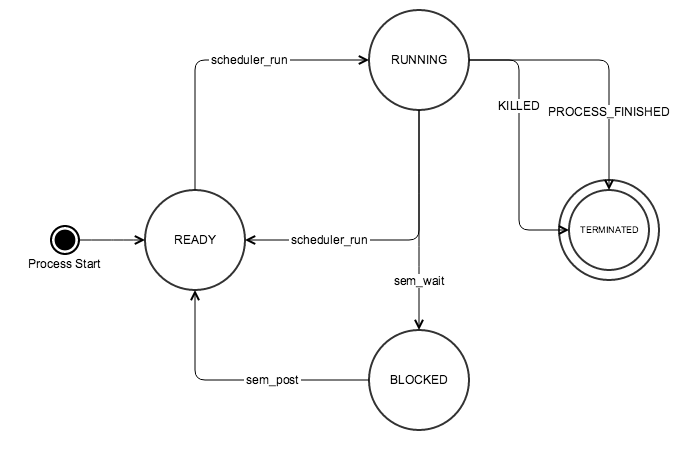

## Scheduler
Scheduling is an important part of the operating system. We have implemented preemptive scheduling which means that a running task is interrupted by the scheduler and continued later on after other processes had some process time.

### Sequence
The following UML diagram shows the cycle of the scheduler.

`__context_save` is a assembly method that is called by the IRQ handler right at the beginning.
It saves all the needed registers into the stack and returns a pointer to the data.
In `C` we use a `struct` for the data. It must be ensured that we save all our data in same order onto the stack as our struct is structured.
This context is saved for every occurring interrupt and not only for the timer IRQ.

All our interrupts have a callback method which will be called by the IRQ handler. In case of our timer this is our scheduling method. As a parameter we pass the context pointer.
There all data from the stack are copied to the static context array using this pointer.
The scheduler then will search for a the next process using a [Round Robin][@round_robin] based method.
The current process state is set to `ready` and the new process gets the state `running`. Also the scheduler replaces the context data with the new process data on the stack.

`__context_load` is also a assembly method which is called by the IRQ handler at the very end.
It loads all data from the stack and writes them to the registers. Also it ensures that the stack is cleaned from all data after we exit.
If we have called the scheduler our context may be altered, which is why we jump to the next process. If this is not the case we jump right back to the interrupted process.

### Details

**Process Time**

The runtime of a process is about 100 ms. We chose this value because of the console and audio performance. Currently we don't use any audio buffer, which is why there are breaks in the output. With shorter runtimes there are more breaks and with longer runtimes the reaction time of a process is getting higher. Having a process runtime of 100 ms is a good tradeoff between audio breaks and input reaction time.

**Number of processes**

The scheduler supports currently only eight processes as we have not ever needed more to this time. However the number of processes can be easily extended.
The MMU technically supports more processes as we wanted our system to be easily extended.

### Process States

All processes start with the ready state. The scheduler sets processes to `running` or `ready`. Some processes may get `blocked` when using the semaphore (see IPC). If an error occurs or a process finishes it gets terminated.

[@round_robin]: https://books.google.at/books?id=RzP3iH0BSW0C&pg=PA60&dq=round+robin+scheduling&hl=en&sa=X&ved=0CB4Q6AEwAGoVChMI09zbh8fkxgIVRj0UCh03zASs#v=onepage&q=round%20robin%20scheduling&f=false "Real-Time Concepts for Embedded Systems, by Qing Li, Caroline Yao, p. 60"
